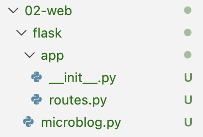
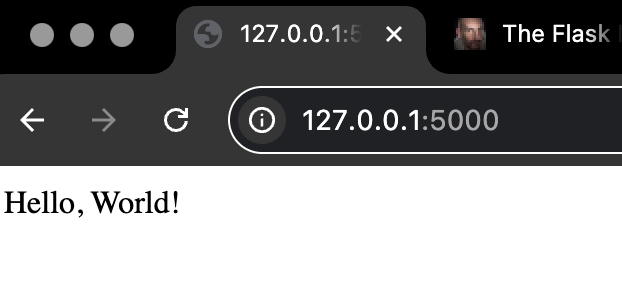

# 01-hello.md
## Hello, World 출력하기 
> 목차  
[0.파일 구조](#0-파일-구조)  
[1. `__init__.py`](#1-__init__py)  
[2. `routes.py`](#2-routespy)  
[3. `microblog.py`](#3-microblogpy)  
[4. 실행](#4-실행)  
* 파일 구조와 뷰 함수의 개념을 이해하고 Hello world를 출력해보기  

## 0. 파일 구조 
* 이제부터 진행하는 모든 쉘 코드는 가상환경을 활성화한 상태에서 실행한다.
* 먼저 아래와 같이 폴더와 파일을 생성한다. 이름은 동일하게 설정해야 이후 내용에서 경로 문제가 발생하지 않을 것이다.
* 레포지토리를 따로 파도 상관없다.


* 생성한 뒤 각 파일에 아래 코드들을 작성/붙여넣기
1. `__init__.py`
   * Flask 앱 객체를 만든다
2. `routes.py`
   * URL과 함수(뷰 함수)를 연결한다
3. `microblog.py`
   * Flask 앱을 가져와 실행한다

## 1. `__init__.py`
```py
from flask import Flask

app = Flask(__name__)

from app import routes
```
<details>
<summary> 설명 </summary>
<div>

```py
from flask import Flask
app = Flask(__name__)
```
* 위 스크립트에서는 `flask` 패키지에서 가져온 `Flask` 클래스로
* 웹 애플리케이션 객체(`app`)를 하나 만든다.
* `Flask(__name__)`에서 `__name__`은 파이썬에 원래부터 있는 변수다.
    * 이 파일이 직접 실행되면 `__main__`
    * 다른 파일에서 import되면 파일 이름이라는 값을 가진다.
* Flask는 이 값을 이용해서 관련 파일들이 어디에 있는지 기준 위치를 파악한다.
    * 템플릿 파일(`templates/`)
    * 정적 파일(`static/`)

```python
from app import routes
```
* `app`이 두 가지 의미로 쓰인다.
1. `app` 패키지
    * `app/` 디렉토리
    * 그 안의 `__init__.py` 등을 사용할 수 있게 해준다. 
2. `app` 변수
    * `__init__.py` 안에서 만든 `Flask` 클래스의 인스턴스
    * app = Flask(_\_name__)

* 파일 맨 밑에서 import하는 이유
* 보통 파이썬에서는 파일 제일 위쪽에서 import문을 자주 쓴다(아닌 경우 많음)
* 위 코드가 제일 밑에 있는 이유는 circular import 문제 해소를 위함 
  * `__init__.py` -> `routes`를 import함
  * `routes.py` -> 다시 `app` 변수를 import해야 함
  * 순환 문제 발생
  * 따라서 한쪽의 import를 맨 아래로 내려서 Flask 앱 객체가 먼저 만들어지게 한다

</div>
</details>

## 2. `routes.py`
```py
from app import app

@app.route('/')
@app.route('/index')
def index():
    return "Hello, World!"
```

<details>
<summary> 설명 </summary>
<div>

* Flask에서는 URL 하나 = 파이썬 함수 하나로 처리한다.
* 이 함수들을 **뷰 함수(View Function)** 라고 부른다.
* `routes` 모듈은 이 웹앱이 어떤 URL을 지원하는지를 정의하는 곳이다.
    * `/` 로 접속했을 때 무슨 코드가 실행될지
    * `/index` 로 접속했을 때 무슨 코드가 실행될지 등등 
    * 어떤 URL로 요청이 오면, 이 함수를 실행하라는 규칙을 코드로 적는 게 `routes.py`의 역할이다.

* 우리의 헬로 월드 예제 
```python
from app import app

@app.route('/')
@app.route('/index')
def index():
    return "Hello, World!"
```
* `from app import app`
    * `app` 패키지 안에 있는
    * Flask 애플리케이션 객체 `app`을 가져온다
* `@app.route('/')`
    * 데코레이터(decorator)
    * 아래에 있는 함수를 `/` 주소랑 연결시킴
* `@app.route('/index')`
    * `/`
    * `/index`
    * 두 URL 모두아래 함수로 연결하겠다는 뜻
* `def index():`
    * 뷰 함수
    * 웹 브라우저가 `/` 또는 `/index`로 요청하면 이 함수가 실행되고 반환값이 브라우저로 전달된다
> 사용자가 `/` 또는 `/index`로 접속하면
> Flask는 `index()` 함수를 실행하고
> `"Hello, World!"`를 응답으로 돌려준다.

</div>
</details>

## 3. `microblog.py`
```py
from app import app
```

<details>
<summary> 설명 </summary>
<div>

* `microblog.py`: 앱 실행용 파일
* `app` 패키지 안에 있는
* Flask 애플리케이션 객체 `app`을 가져온다
* 그리고 이 파일을 기준으로 Flask 앱을 실행한다.

</div>
</details>


## 4. 실행
1. 터미널에 아래 코드를 입력 (아무것도 안뜨는 게 정상임)
    ```sh
    export FLASK_APP=microblog.py
    ```
    * 문제: 터미널 열 때마다 환경 변수를 설정해줘야 함
    * 자동으로 해 줬으면 좋겠다: 아래 코드 쉘에 쳐서 다운받은 다음, 이미지와 같이 폴더 생성하고 안에 환경변수 작성
    ```sh
    pip install python-dotenv
    ```
    * 
2. flask 폴더에 들어간다( 예: 현재 study 파일 안에 있으면 `cd 02-web/flask`)
3. 터미널에 아래 코드를 입력
    ```sh
    flask run
    ```
    * 해당 명령어 실행 시 Flask는 FLASK_APP 환경 변수에 지정된 파일을 먼저 확인
    * FLASK_APP=microblog.py으로 환경 변수를 위에서 지정했으므로, microblog.py에서 Flask 애플리케이션 객체(app)를 찾는다.
    * 그런 다음 Flask는 개발용 웹 서버를 실행하고 들어오는 웹 요청을 이 Flask 앱으로 전달하도록 설정한다.
4. 결과
    ```sh
    * Serving Flask app 'microblog.py'
    * Debug mode: off
    WARNING: This is a development server. Do not use it in a production deployment. Use a production WSGI server instead.
    * Running on http://127.0.0.1:5000
    Press CTRL+C to quit
    ```
    * `127.0.0.1`==`localhost`은 항상 자기 자신의 컴퓨터를 가리키는 IP 주소다
    * 포트 번호는 왜 5000? -> 웹 서버는 특정 IP 주소:특정 포트 번호에서 요청을 기다린다.
    * Flask는 개발 환경에서 기본값으로 포트 5000을 사용한다.
5. 아무 웹 브라우저를 켜고 http://127.0.0.1:5000/ 접속
    * Running on http://127.0.0.1:5000 <-결과에 나온 해당 주소로 가는 거임 
    * 아까 `routes.py`에서 `/`와 `/index`에 모두 뷰 함수를 연결시켰으므로 http://127.0.0.1:5000/index 에 가도 같은 결과 확인 가능하다.
6. 작동 확인

7. 종료는 `Ctrl + C`


