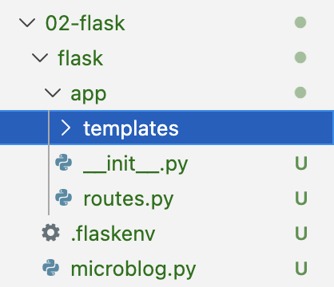

# 02-templates.md
## Templates 사용하기 
> 목차  
[1. 템플릿 없이 구현하기](#1-템플릿-없이-구현하기)  
[2. 템플릿 사용해서 구현하기](#2-템플릿-사용해서-구현하기)  
[3. 템플릿 상속을 사용해서 구현하기](#3-템플릿-상속을-사용해서-구현하기)  

* 템플릿을 작성하고 뷰 함수에서 불러와 사용하기  

## 1. 템플릿 없이 구현하기
### Mock data
* 기능 구현이 안 되었는데 관련 기능을 사용하는 다른 기능을 테스트해보고 싶은 경우 가짜 데이터를 만들어서 임시로 쓴다.
* 여기서는 아직 user 기능을 구현하지 않았으나 관련 기능을 우선적으로 설계하고 확인하기 위해 mock user를 아래와 같이 사용할 것이다
    ```python
    user = {'username': 'aq8u8pa'}
    ```

## (나쁜 예시) Templates 없이 직접 HTML 반환하는 경우 
* 뷰 함수에서 HTML 문자열을 직접 반환할 수도 있다.
* `app/routes.py`에 아래와 같이 함수 내용을 변경 -> 동작함 
    ```python
    def index():
        user = {'username': 'aq8u8pa'}
        return '''
        <html>
            <head>
                <title>Home Page - Microblog</title>
            </head>
            <body>
                <h1>Hello, ''' + user['username'] + '''!</h1>
            </body>
        </html>
        '''
    ```

<details>
<summary> HTML? </summary>
<div>

* 웹페이지 구조와 의미를 정의하는 마크업 언어. 파일 확장자는 html
* 마크다운의 무거운 버전이라고 생각하면 됨(사실 반대입니다. 마크업의 가벼운 버전이 마크다운임)
* 디스코드 채팅에서 특정 문자를 사용하면 밑줄 볼드 등의 표시가 되듯이, HTML 문서에서 태그를 사용하면 문서의 양식을 지정할 수 있습니다.
* 태그 관련 내용은 검색하면 많이 찾아볼 수 있음.
* HTML/CSS <- 이런 식의 표기에서도 나타나듯, 주로 CSS와 함께 사용함(HTML-구조 CSS-디자인 용도로 자주 쓰임)

</div>
</details>

* 단점: 똑같은 페이지를 다른 내용으로 전달하고 싶은 경우 저 내용을 계속 작성해야 함 
    * 길고, 가독성 떨어짐, 반복됨 
    * 레이아웃 변경 시 통일성을 위해서 반복되는 모든 코드를 하나하나 고쳐줘야 함 
* 코드의 재사용성을 높이기 위한 모듈화(Modularization)가 필요함

## 2. 템플릿 사용해서 구현하기
### What Are Templates?
* HTML 구조를 가진 페이지 템플릿
* Flask는 기본적으로 app/templates 디렉토리를 템플릿 경로로 사용한다.
* 그러므로 아래와 같이 `app/templates`폴더를 만들어서 그 안에 템플릿(HTML 파일들) 모아둘 것이다.

* 그걸 Python파일에서 가져다 사용한다

### index: template
* 위 나쁜 예시를 템플릿으로 분리해보자.
* `app/templates/index.html`을 생성해 화면 페이지 템플릿을 작성해준다.
    ```html
    <!doctype html>
    <html>
        <head>
            <title>{{ title }} - Microblog</title>
        </head>
        <body>
            <h1>Hello, {{ user.username }}!</h1>
        </body>
    </html>
    ```
* 위 코드 중 아래와 같은 `{{ ... }}` 부분은 나중에 Python 파일에서 값을 넣어줄 자리다.
* 템플릿 변수(placeholder 역할)로, Python에서 전달한 값을 출력하는 자리다
    ```html
    {{ title }}
    {{ user.username }}
    ```

### index: view
* `app/routes.py` 파일의 뷰 함수를 `render_template()`을 사용해 수정해 준다. 
    * 렌더링(rendering): 템플릿 파일을 읽고 -> 값을 채워서 -> 완성된 HTML을 반환
    ```py
    from flask import render_template
    from app import app

    @app.route('/')
    @app.route('/index')
    def index():
        user = {'username': 'aq8u8pa'}
        return render_template('index.html', title='Home', user=user)
    ```

* Flask는 내부적으로 Jinja라는 템플릿 엔진을 사용한다.
  * Jinja 템플릿에서는 딕셔너리 키도 객체 속성처럼 접근할 수 있다
  (user['username'] == user.username)
  * `{{ ... }}`: 값 출력
  * ``: 제어문 

### 제어문
* 조건문
    * 아래 코드와 같이 사용. title이 있으면 if문 밑의 내용을 출력하고, 없으면 else 밑의 내용을 출력한다. 조건문은 endif로 닫는다.
    ```html
    
    <title>{{ title }} - Microblog</title>
    
    <title>Welcome to Microblog!</title>
    
    ```
* 반복문 (for loop)
    * 개수가 정해지지 않은 데이터를 처리할 때 주로 사용한다.
    * 반복문을 사용하기 위해 mock data(게시물)을 뷰 `app/routes.py`에 아래와 같이 추가해준다.
    ```python
    from flask import render_template
    from app import app

    @app.route('/')
    @app.route('/index')
    def index():
        user = {'username': 'aq8u8pa'}
        posts = [
            {
                'author': {'username': 'John'},
                'body': 'Beautiful day in Portland!'
            },
            {
                'author': {'username': 'Susan'},
                'body': 'The Avengers movie was so cool!'
            }
        ]
        return render_template('index.html', title='Home', user=user, posts=posts)
    ```

* 템플릿 `app/templates/index.html`에서는 아래와 같이 구현된다.
    * for item in iterable 형태로 시작해 endfor로 닫는다.
    ```html
    <!doctype html>
    <html>
        <head>
            
            <title>{{ title }} - Microblog</title>
            
            <title>Welcome to Microblog</title>
            
        </head>
        <body>
            <h1>Hi, {{ user.username }}!</h1>
            
            <div><p>{{ post.author.username }} says: <b>{{ post.body }}</b></p></div>
            
        </body>
    </html>
    ```

## 3. 템플릿 상속을 사용해서 구현하기
### 템플릿 상속 (Template Inheritance)

* base template: 공통 요소를 뼈대로 잡고 추가 기능이 있는 경우에만 상속을 통해 구현하기 위해 만든다 (공통 구조)
* 여러 페이지에 공통으로 들어가는 요소: 제목, 네비게이션 바, 전체 레이아웃 등

* 먼저 `app/templates/base.html`에 베이스 템플릿을 아래와 같이 작성한다. 
    * ``<- 여기에 자식 템플릿을 끼워 넣는다 
    ```html
    <!doctype html>
    <html>
    <head>
        
        <title>{{ title }} - Microblog</title>
        
        <title>Welcome to Microblog</title>
        
    </head>
    <body>
        <div>Microblog: <a href="/index">Home</a></div>
        <hr>
        
    </body>
    </html>
    ```

* `app/templates/index.html`에서 상속하기
    * 으로 상속받아,  사이에 추가 기능을 구현
    ```html
    

    
    <h1>Hi, {{ user.username }}!</h1>
    
    <p>{{ post.author.username }} says: {{ post.body }}</p>
    
    
    ```