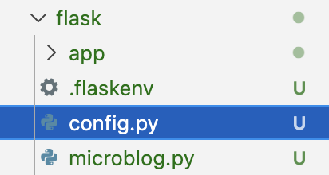
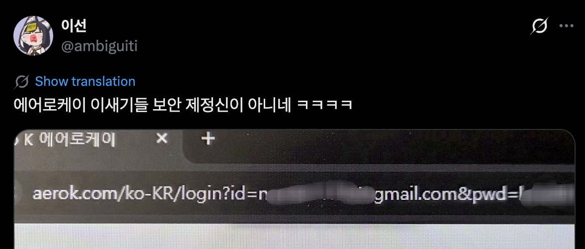
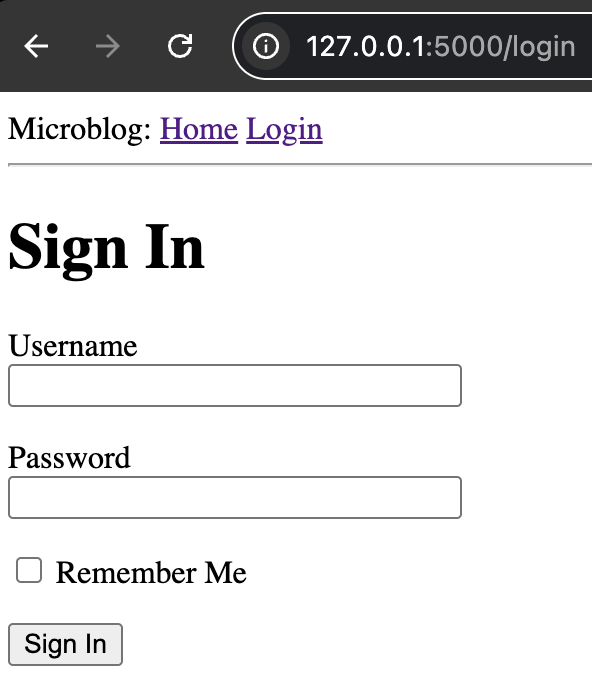
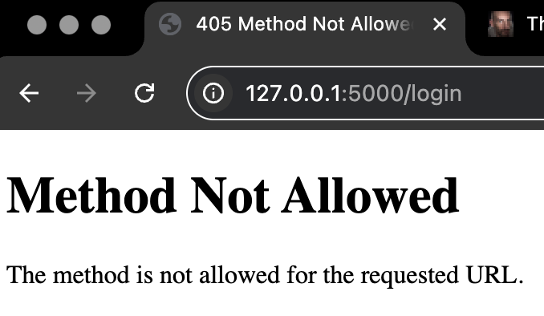
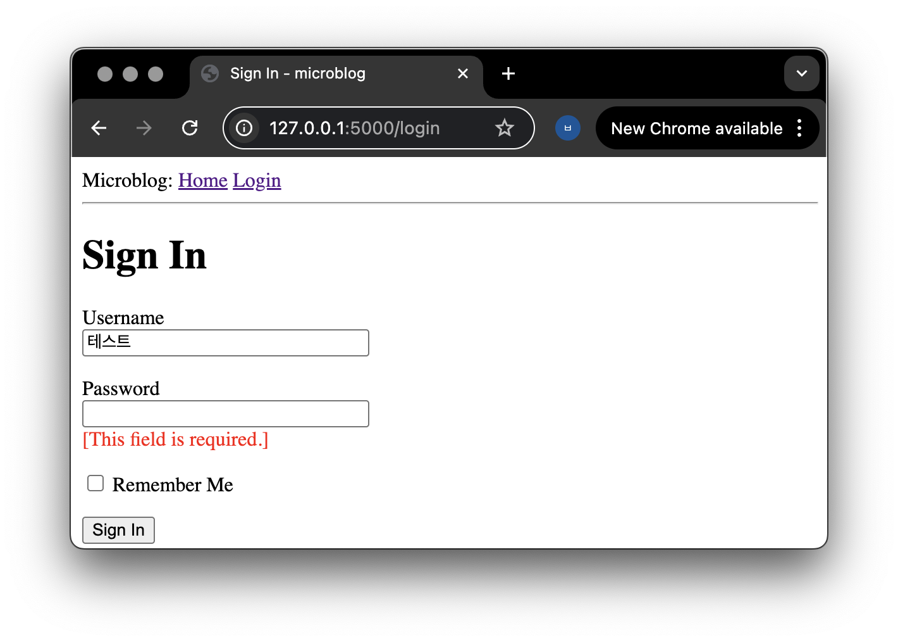

# 03-web_forms.md
## Web Forms 사용하기 
> 목차  
[1. Configuration](#1-configuration)  
[2. Login form](#2-login-form)  
[3. 템플릿 상속을 사용해서 구현하기](#3-generating-links)  

* login 예제를 통해 웹 폼을 만들고 템플릿과 뷰에서 받아 사용하기 
* Flask에서 웹 폼을 다루기 위해 터미널에서 Flask-WTF 익스텐션 다운로드
  ```sh
  pip install flask-wtf
  ```
## 1. Configuration
* 웹이 복잡해지면  Flask와 익스텐션들이 참고할 config가 필요함 
* 물론 아래처럼 웹앱 코드에 바로 써도 동작은 하지만
  ```py
  app.config['SECRET_KEY'] = 'you-will-never-guess'
  ```
* config 파일을 따로 분리하는 것을 추천한다.
  
  ```py
  import os

  class Config:
      SECRET_KEY = os.environ.get('SECRET_KEY') or 'you-will-never-guess'
  ```
  * 설정값은 `Config` 클래스의 변수로 정의한다
  * 나중에 config가 늘어나면 여기에 추가하면 된다
  * 필요하면 여러 config 클래스로 확장할 수도 있다

### SECRET_KEY
* `SECRET_KEY`: Flask 등이 서명, 토큰 생성 등에 사용하는 비밀 키다
* Flask-WTF에서는 CSRF 공격 방어에 이 키를 사용한다
* SECRET이라고 써있다시피 외부에 노출되면 안 되는 값이다. 

* 만들고 적용하는 법 
  * 터미널에 `python -c "import secrets; print(secrets.token_hex(32))"` 쳐서 나온 값을 
  * `.flaskenv` 파일 열어서 
  * SECRET_KEY=여기에 복붙  
    
* **!!!주의사항!!!** 
  * 가만히 두면 깃허브에 올라간다. 공개하면 안 되겠죠
  * 레포지토리에 `.gitignore`라는 파일을 만들어서 안에 `.flaskenv` 쓰고, 파일 글씨가 회색(무시) 됐는지 확인한 뒤에 깃에 올리시길 
    * 이건 잡설인데 우리 학교에서 어떤 사람이 어떤 키를 이런 식으로 깃허브에 올렸다가 털려서 엄청난 금액을 청구받은 적이 있다. 공개된 장소 뿐만이 아니라 카톡이나 개인 디스코드 등에 올리는 것도 자제하는 것이 좋다... 지피티 등 인공지능에게도 보내지 마시길(물어볼 생각이라면 '키 내용' 식으로 텍스트를 대체해도 알아듣는다).


### `.env` / `.flaskenv`와 환경 변수

```py
os.environ.get('SECRET_KEY') or 'you-will-never-guess'
```
1. 환경 변수 `SECRET_KEY`가 있으면 그걸 사용
2. 없으면 기본 문자열 'you-will-never-guess' 사용
  * 개발 환경: 기본값 사용해도 괜찮음
  * 운영 환경(서버 배포 시): 반드시 환경 변수로 설정

### Flask에 config 적용하기

* `app/__init__.py`에서 config를 불러온다.
  ```python
  from flask import Flask
  from config import Config

  app = Flask(__name__)
  app.config.from_object(Config)

  from app import routes
  ```

* `config` == `config.py` 파일
* `Config` == 그 안의 클래스

## 2. Login form
### login: form
* Flask-WTF에서는 폼 하나 == 파이썬 클래스 하나
* 폼 관련 코드는 분리해서 `app/forms.py`에 작성한다.
  ```python
  from flask_wtf import FlaskForm
  from wtforms import StringField, PasswordField, BooleanField, SubmitField
  from wtforms.validators import DataRequired

  class LoginForm(FlaskForm):
      username = StringField('Username', validators=[DataRequired()])
      password = PasswordField('Password', validators=[DataRequired()])
      remember_me = BooleanField('Remember Me')
      submit = SubmitField('Sign In')
  ```
  * `FlaskForm` : 모든 폼의 기본 클래스
  * 필드(username, password 등)는 클래스 변수로 정의
  * `DataRequired`: 비어 있으면 안 되는 필드 검증

### login: template

* `app/templates/login.html` 생성 후 작성 
  ```html
  

  
  <h1>Sign In</h1>
  <form action="" method="post" novalidate>
      {{ form.hidden_tag() }}
      <p>
          {{ form.username.label }}<br>
          {{ form.username(size=32) }}
      </p>
      <p>
          {{ form.password.label }}<br>
          {{ form.password(size=32) }}
      </p>
      <p>{{ form.remember_me() }} {{ form.remember_me.label }}</p>
      <p>{{ form.submit() }}</p>
  </form>
  
  ```
  * HTML의 `<form>` 요소는 웹 폼 전체를 감싸는 컨테이너다
  * `action` 속성은 폼을 제출할 URL을 지정하며, 비워 두면 현재 페이지의 URL로 제출된다.
  * `method` 속성은 요청 방식을 지정하고, 기본값은 `get`
    * `get`은 입력값이 URL(주소창)에 포함되고, `post`는 요청 본문(body)에 담겨 전송된다.
    * 로그인, 글 작성처럼 입력 데이터가 많거나 URL에 드러나면 어색한 경우에는 보통 `post`를 사용한다
    * [GET의 나쁜 예시](https://x.com/ambiguiti/status/2018151285762195703?s=46)*GET만의 문제는 아니긴 한데 직관적이라 가져왔음 
    
  * `novalidate` 속성은 브라우저의 기본 유효성 검사를 비활성화하여, 검증을 서버(Flask)에서 처리하도록 한다.
    * `novalidate`는 선택 사항이지만, 서버 사이드 검증을 테스트하기 위해 이 예제에서 사용 
  * `{{ form.hidden_tag() }}` -> CSRF 보호용 토큰 자동 생성

### login: view
* `app/routes.py`에 아래 내용 추가 
  ```python
  from app.forms import LoginForm

  @app.route('/login')
  def login():
      form = LoginForm() # 폼 객체를 생성
      return render_template('login.html', title='Sign In', form=form) # 템플릿으로 전달
  ```

### login: base template
* `app/templates/base.html`의 <div> 사이에 아래 내용 작성 
  ```html
  <div>
      Microblog: <!--이런 내용 바꿔보면서 웹에서 어떤 부분이 영향받는지 직접 확인해보면 html은 금방 익힐 수 있음-->
      <a href="/index">Home</a>
      <a href="/login">Login</a>
  </div>
  ```

### login: run
* flask run 해서 로그인 화면에 진입해보자.
  

### login: 405 Method Not Allowed
* 로그인을 해 보자.
  
* 이유: POST 요청이 들어왔는데 뷰 함수는 GET만 허용하고 있었기 때문
* 이게 뭔 소릴까?: 
  * 폼을 만들고
  * 폼을 보여줄 템플릿을 만들고
  * 템플릿을 받아 보여주는 뷰도 연결해 줬다.
  * 그런데 정작 유저가 데이터를 입력했을 때 '어떻게' 처리할 지에 대해서는 전혀 구현을 안 했다.
  * 받지도(receiving) 못해서 post를 못한 상태!

### login: receiving form data
* `app/routes.py`에 아래 내용 추가 
  ```py
  from flask import render_template, flash, redirect

  @app.route('/login', methods=['GET', 'POST'])
  def login():
      form = LoginForm()
      if form.validate_on_submit():
          flash('Login requested for user {}, remember_me={}'.format(
              form.username.data, form.remember_me.data))
          return redirect('/index')
      return render_template('login.html', title='Sign In', form=form)

  ```
* `validate_on_submit()`

  |  | GET 요청 | POST 요청 |
  |---|---|---|
  | 검증 실패 | False | False |
  | 검증 성공 | False | True |
* `flash()`
  * 사용자에게 한 번 보여줄 메시지 저장
* `redirect()`
  * 다른 URL로 이동

### flash: base template
* `base.html`에 추가(flash 메세지 양식 통일용)
  ```html
  ...
          <hr>
          
          
          <ul>
              
              <li>{{ message }}</li>
              
          </ul>
          
          
          
      </body>
  </html>
  ```
  * 템플릿에서 `get_flashed_messages()`를 `with` 구문으로 받아 `messages` 변수에 저장한다
  * 이 함수는 Flask의 `flash()`로 등록된 메시지들을 리스트로 반환한다
  * `messages`가 비어 있지 않으면 `<ul>`과 `<li>`로 각 메시지를 화면에 출력한다
  * 플래시 메시지는 한 번 조회되면 자동으로 삭제되어 한 번만 표시된다.
  * 폼 테스트 시, 아이디나 비밀번호를 비워 제출하면 `DataRequired` 검증이 동작해 제출이 막히는 것을 확인할 수 있다.

### login: Improving Field Validation

<details>
<summary> app/templates/login.html 전체 코드  </summary>
<div>

```html



    <h1>Sign In</h1>
    <form action="" method="post" novalidate>
        {{ form.hidden_tag() }}
        <p>
            {{ form.username.label }}<br>
            {{ form.username(size=32) }}<br>
            
            <span style="color: red;">[{{ error }}]</span>
            
        </p>
        <p>
            {{ form.password.label }}<br>
            {{ form.password(size=32) }}<br>
            
            <span style="color: red;">[{{ error }}]</span>
            
        </p>
        <p>{{ form.remember_me() }} {{ form.remember_me.label }}</p>
        <p>{{ form.submit() }}</p>
    </form>

```

</div>
</details>

```html

<span style="color:red">[{{ error }}]</span>

```
  * validators가 있는 any form 아래에 작성한다. (general rule)
  * `form.<필드>.errors`는 리스트: 여러 validators가 있을 수 있기 때문
  

---

## 3. Generating Links
* 지금까지는 템플릿의 링크를 다음과 같이 작성했다.
  ```html
  <a href="/index">Home</a>
  <a href="/login">Login</a>
  ```
  * 이러한 작성 방식을 하드 코딩이라 부르는데(그냥 있는대로 갖다 썼다는 뜻)
  * URL 변경 시 전체 수정이 필요하다는 문제가 있다.

### url_for()
* url_for()는 뷰 함수 이름(endpoint)을 기반으로 URL을 생성한다.
  ```py
  url_for('login')    #/login
  url_for('index')    #/index
  ```
  * 인자는 뷰 함수 이름: URL보다 뷰 함수 이름이 변경될 가능성이 훨씬 낮기 때문에 유지보수에 유리하다.
  * 동적 URL이 있는 경우에도 url_for()는 안전하고 간결하게 URL을 생성할 수 있다.
  * 따라서 링크와 리다이렉트는 모두 url_for()를 사용
* `app/templates/base.html`
  ```html
  <a href="{{ url_for('index') }}">Home</a>
  <a href="{{ url_for('login') }}">Login</a>
  ```
* `routes.py`
  ```python
  from flask import ..., url_for

  @app.route('/login', methods=['GET', 'POST'])
  def login():
      form = LoginForm()
      if form.validate_on_submit():
          # ...
          return redirect(url_for('index'))
      # ...
  ```
