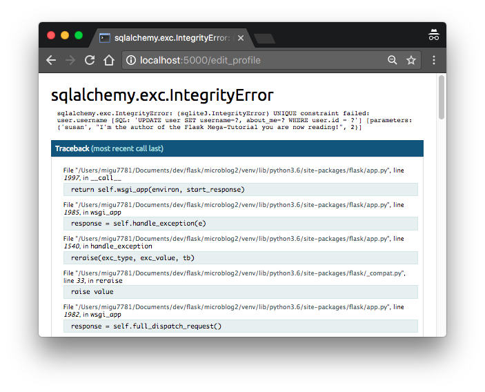
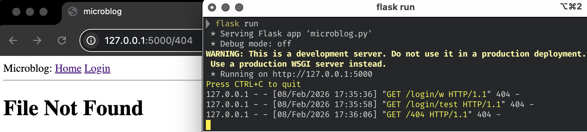

# 04-error_handling.md
## Error handling
> 목차  
[1. Error Handling in Flask](#1-error-handling-in-flask)  
[2. Debug Mode](#2-debug-mode)  
[3. Custom Error Pages](#3-custom-error-pages)  
[4. Sending Errors by Email](#4-sending-errors-by-email)
[5. Logging to a File](#5-logging-to-a-file)

* [The Flask Mega-Tutorial, Part VII: Error Handling](https://blog.miguelgrinberg.com/post/the-flask-mega-tutorial-part-vii-error-handling)
* 에러를 발견하고, 보기 좋게 처리하는 방법


## 1. Error Handling in Flask
* 에러 발생 시
  * 사용자 화면: `Internal Server Error` (자세한 정보 없음)
  * 서버 터미널: stack trace 출력 (에러 원인 추적용)
    * 예시(아래 내용을 천천히 읽어보면서 무슨 뜻인지 짐작해 보세요) 
    ```sh
    ([2023-04-28 23:59:42,300] ERROR in app: Exception on /edit_profile [POST]
    Traceback (most recent call last):
      File "venv/lib/python3.11/site-packages/sqlalchemy/engine/base.py", line 1963, in _exec_single_context
        self.dialect.do_execute(
      File "venv/lib/python3.11/site-packages/sqlalchemy/engine/default.py", line 918, in do_execute
        cursor.execute(statement, parameters)
    sqlite3.IntegrityError: UNIQUE constraint failed: user.username
    ```
* 이렇게 사용자에게 내부 구현(DB, 테이블 등)을 숨기는 이유는 보안을 위해서임 

## 2. Debug Mode
### Debug Mode
* 위 상황처럼 읽기 어렵게 스택 트레이스만 띡 던져주면 읽기 귀찮잖아요 
* 브라우저에서 에러 원인 + 코드 위치 + 변수 값까지 볼 수 있게 해줌
* 에러 발생 시 인터랙티브 디버거 제공

### 활성화 방법
```bash
export FLASK_DEBUG=1
flask run
```
* 활성화 후 서버 재시작(flask run)시 아래와 같이 뜸
  ```sh
  * Serving Flask app 'microblog.py' (lazy loading)
  * Environment: development
  * Debug mode: on
  * Running on http://127.0.0.1:5000/ (Press CTRL+C to quit)
  * Restarting with stat
  * Debugger is active!
  * Debugger PIN: 118-204-854
  ```
* 디버그 모드에서 에러 발생 시 이제 쉘이 아니라 브라우저에서 다음과 같이 나타남
  

### 장점
* 에러 난 줄 쉽게 확인 가능: 스택 프레임 확장하고 코드 확인 
* 모든 프레임에서 파이썬 프롬프트를 열고 코드를 실행해서 변수 값 확인 가능
* 코드 수정 시 자동 재시작(reloader)

### 절대 운영 서버에서 사용 금지
* 원격 코드 실행 가능하기 때문에 보안 문제
* 우리는 아직 배포도 안 했기 때문에 나중에 신경쓰시면 됩니다 

## 3. Custom Error Pages
* 왜 쓰는 걸까?
  * 기본 에러 페이지(Internal Server Error)는 못생김
  * 유저 입장에서 브라우저 쓰다가 저런 화면을 보면 덜 만든 홈페이지다, 뭘 어떻게 해야할 지 모르겠다는 감상을 받게 됨 

### 404 500 에러 핸들링 예제  
* `@app.errorhandler(에러코드)` 데코레이터 사용
* `app/error.py`파일을 생성하고 아래 내용을 작성
  ```py
  from flask import render_template
  from app import app, db

  @app.errorhandler(404)
  def not_found_error(error):
      return render_template('404.html'), 404

  @app.errorhandler(500)
  def internal_error(error):
      # db.session.rollback()
      return render_template('500.html'), 500
  ```
  * 404, 500 에러가 발생할 시 각각 '404.html', '500.html' 템플릿으로 렌더링하라는 내용 (routes.py의 뷰 함수와 유사한 방식으로 작동)
  * return의 두 번째 인자로 넘기는 값(400, 500)은 error code number로, 지정하지 않는 경우 기본값 200임 
  * DB 에러(500) 후에는 반드시 `db.session.rollback()`: 오류 난 기존의 데이터베이스 세션이 다른 데이터베이스 접근을 방해하지 않도록 세션을 롤백해서 문제 없는 상태로 만들어줘야 한다. 
  * **다만 아직 우리는 db를 진행하지 않았으므로 해당 내용을 잠깐 주석처리 해 두고 넘어간다**(그냥 두면 실행 시 에러 발생함)
* `app/__init__.py`에서 위 파일을 import해준다.
  ```py 
  from app import routes, errors
  ```
* 이제 위 파일이 렌더링 할 템플릿 파일을 작성해 줘야 한다. `base.html` 상속해서 UI를 통일시켜 줄 거임 
  * `app/templates/404.html`: 페이지 없음
  ```sh
  

  
      <h1>File Not Found</h1>
      <p><a href="{{ url_for('index') }}">Back</a></p>
  
  ```
  * `app/templates/500.html`: 서버 내부 오류
  ```sh
  

  
      <h1>An unexpected error has occurred</h1>
      <p>The administrator has been notified. Sorry for the inconvenience!</p>
      <p><a href="{{ url_for('index') }}">Back</a></p>
  
  ```

## 4. Sending Errors by Email
* 운영 서버용. 에러 발생 시 이메일로 전달되게 하는 방법 
  * 디버그 모드일 때는 비활성화
* 왜 쓰는 걸까?
  * 운영 서버에서는 터미널을 계속 볼 수 없음
  * 그러나 에러를 즉시 알아야 함
  * -> 이메일로 쏘자 
* logging + SMTPHandler 사용
* 에러 발생 시 관리자 이메일로 stack trace 전송


### 테스트 방법
1. `config.py`에 아래 내용 입력
  ```py
  class Config:
    # ...
    MAIL_SERVER = os.environ.get('MAIL_SERVER')
    MAIL_PORT = int(os.environ.get('MAIL_PORT') or 25)
    MAIL_USE_TLS = os.environ.get('MAIL_USE_TLS') is not None
    MAIL_USERNAME = os.environ.get('MAIL_USERNAME')
    MAIL_PASSWORD = os.environ.get('MAIL_PASSWORD')
    ADMINS = ['your-email@example.com']
  ```
  * 왜 환경 변수(os.environ) 를 쓰나?
    * 코드에 메일 서버 주소 / 비밀번호를 직접 쓰면 깃허브에 올라감. 보안 사고
    * 환경 변수 사용: 서버에만 값 존재, 코드에는 노출 안 됨
  * `MAIL_SERVER`
    * SMTP 메일 서버 주소
    * 예: `smtp.googlemail.com`, `localhost` (테스트용)
    * 메일 서버 설정 안 했으면 메일 안 보냄)
  * `MAIL_PORT`
    * 메일 서버 포트
    * TLS 사용 시 보통 587 씀 
  *  `MAIL_USE_TLS`
    * 메일을 암호화해서 보낼지 여부
    * 환경변수가 존재하면 True
  * `MAIL_USERNAME`, `MAIL_PASSWORD`
    * 메일 서버 로그인 정보
    * 필요한 경우에만 사용
    * 로컬 테스트나 내부 SMTP는 없을 수도 있음
  * `ADMINS`
    * 에러 메일을 받을 사람 목록
2. 가짜 메일 받기 (콘솔로 확인)
  * 진짜 메일 보내지 않고, 터미널에 메일 내용을 띄워보는 테스트 
  ```sh
  export MAIL_SERVER=localhost
  export MAIL_PORT=8025
  export FLASK_DEBUG=0
  pip install aiosmtpd
  aiosmtpd -n -c aiosmtpd.handlers.Debugging -l localhost:8025
  ```
  * 아무 출력 없이 멈춰있는 게 정상임. 일단 켜둔 채로 두고, 다른 창 열어서 `flask run`
  * 블로그 주소 뒤에 존재하지 않는 페이지 주소를 입력하면 콘솔창에 에러 메세지가 뜨는 것을 확인할 수 있음
  

<details>
<summary> 3. 실제 이메일 받기 </summary>
<div>

```sh
export MAIL_SERVER=smtp.googlemail.com
export MAIL_PORT=587
export MAIL_USE_TLS=1
export MAIL_USERNAME=실제 메일 주소@gmail.com
export MAIL_PASSWORD=앱비밀번호
export FLASK_DEBUG=0
```
* Google 계정 보안 -> 앱 비밀번호 생성 -> 16자리 비밀번호 사용
* flask run 실행 후 에러 발생하면 실제로 메일 전송됨 

</div>
</details>


## 5. Logging to a File
* 예외까지는 아니지만 이상한 상황 / 나중에 분석하면 도움이 될 만한 정보 등등 핸들링하기 위해 로그를 찍는 것이 필요함
* `RotatingFileHandler` 사용
  * 파일 크기가 커지면 자동으로 새 파일로 교체
* `app/__init__.py`에 아래 내용 추가
  ```py
  from flask import Flask
  from config import Config

  app = Flask(__name__)
  app.config.from_object(Config)

  from app import routes, model, errors
  import logging
  from logging.handlers import RotatingFileHandler
  import os

  if not app.debug:
      if not os.path.exists('logs'):
          os.mkdir('logs')
      file_handler = RotatingFileHandler('logs/microblog.log', maxBytes=10240,
                                        backupCount=10)
      file_handler.setFormatter(logging.Formatter(
          '%(asctime)s %(levelname)s: %(message)s [in %(pathname)s:%(lineno)d]'))
      file_handler.setLevel(logging.INFO)
      app.logger.addHandler(file_handler)

      app.logger.setLevel(logging.INFO)
      app.logger.info('Microblog startup')
  ```
  * `RotatingFileHandler('로그 파일 경로', maxBytes=최대용량, backupCount=백업파일갯수)`
  * `logging.Formatter`: 로그 형식을 지정하는 함수. 위 코드에서는 시간(asctime), 로그 레벨(levelname), 로그 메시지(message), 파일 경로명(pathname), 몇 번째 줄(lineno)에서 발생했는지 기록한다.
  * `INFO`
    * 로그에는 여러 단계가 있습니다. 덜 심각한 순서대로 
    * DEBUG, INFO, WARNING, ERROR, CRITICAL
    * 위 코드에서는 setLevel(logging.INFO)로 하여 INFO 이상의 문제들을 로깅하게 설정합니다. 

<details>
<summary> setLevel 여러번 하는 이유 </summary>
<div>

* Python logging 구조
  * Logger  ->  Handler  ->  출력 (파일, 콘솔, 이메일 등)
  * Logger는 1차 필터, Handler는 2차 필터

* 구성요소
* Logger (app.logger)
  * 이 로그를 처리할지 말지 1차 결정

* Handler (file_handler 등)
  * 어디로 보낼지 2차 결정
  * 각 handler도 자기만의 레벨 필터를 가짐. 
  * 즉 필터를 두 번 거르는 것이기 때문에 아래와 같이 둘 다 레벨을 설정해줘야 한다.
  ```python
  file_handler.setLevel(logging.INFO)
  app.logger.setLevel(logging.INFO)
  ```
  * 둘 다 성립하는 로그 레벨의 경우에만 통과 

* 활용법
  * 아래와 같이 파일/콘솔/이메일 등 로그를 다르게 찍고 싶은 경우 활용 
  ```python
  app.logger.setLevel(INFO)

  file_handler.setLevel(INFO)
  mail_handler.setLevel(ERROR)
  ```
  * 파일에는 INFO 이상만, 메일에는 ERROR 이상만 찍히는 구조

</div>
</details>
    
## 6. Fixing the Duplicate Username Bug
* 추후 로그인 페이지 만들고 난 다음(7이나 8)에 다룰 예정 
